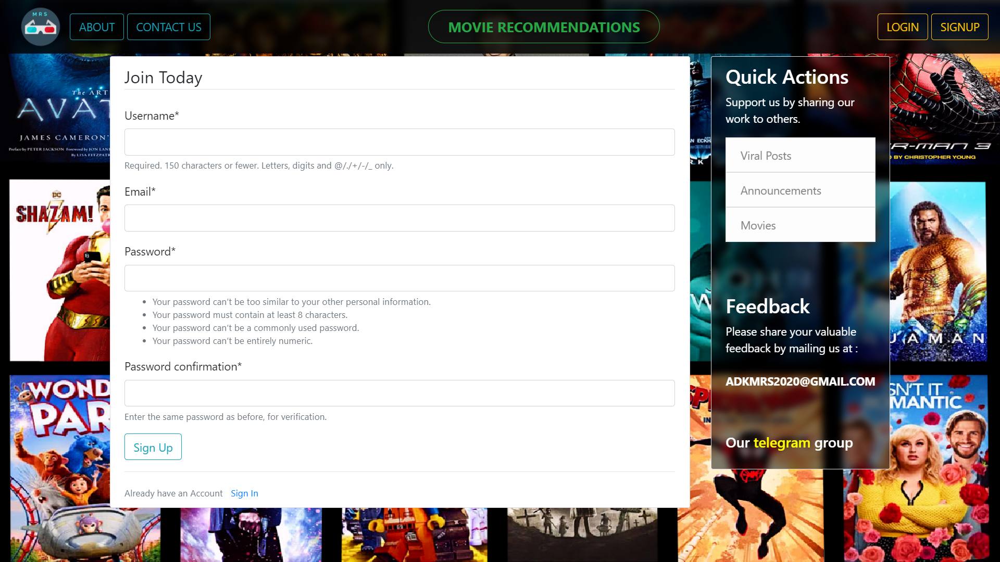

# MRS-community
Movie Recommendation System with community 

Kaggle Datasets : IMDb 80k and TMDb 5000 Dataset
(For Hollywood Movies)

Developed a Movie Recommendation System using content based filtering on categorical features like movie title, genres, actor and director names. 
Used the Tf-Idf vectoriser for converting text data to vectors and applied the concept of angular distance for finding the similarity scores based on cosine similarly.

Users will search for the movie of their interest and will get top 10 recommended movies along with the movie and cast details of the searched movie.

Developed a community with proper login, logout and forget password functionalities where users can post blogs/reviews regarding movies and other users can write comments on those posts.

